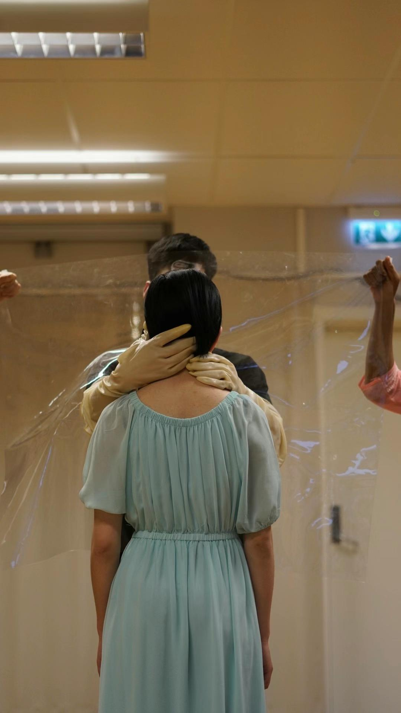
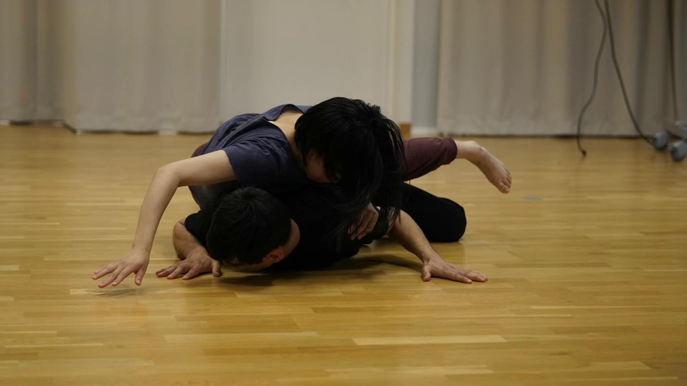
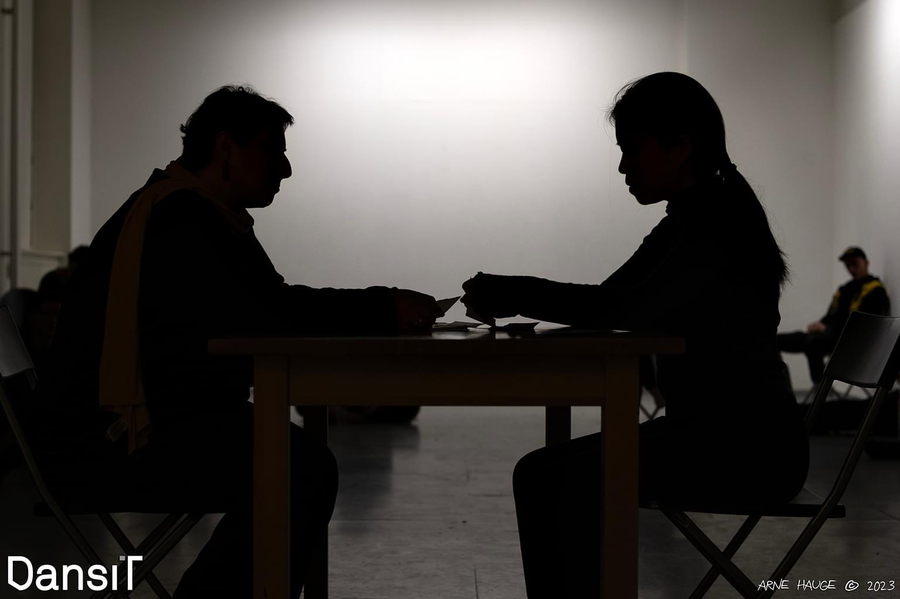
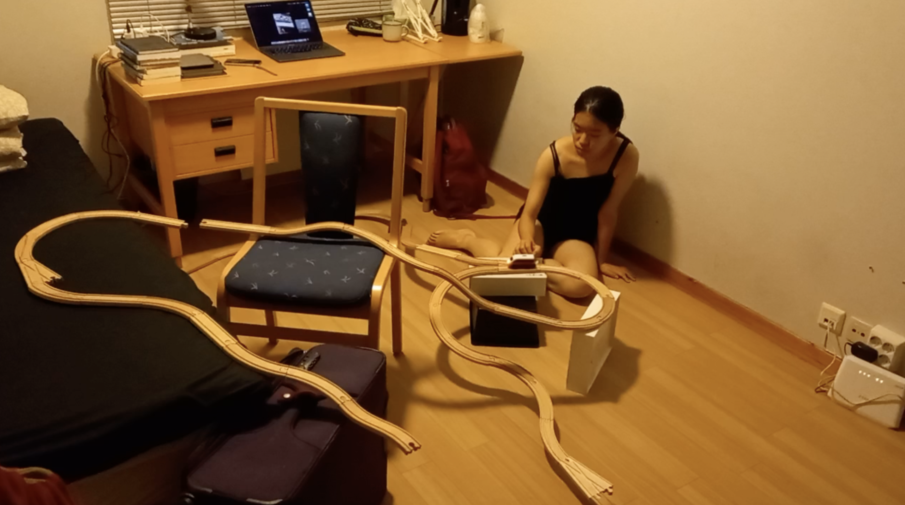
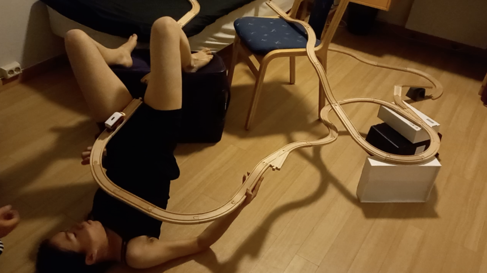
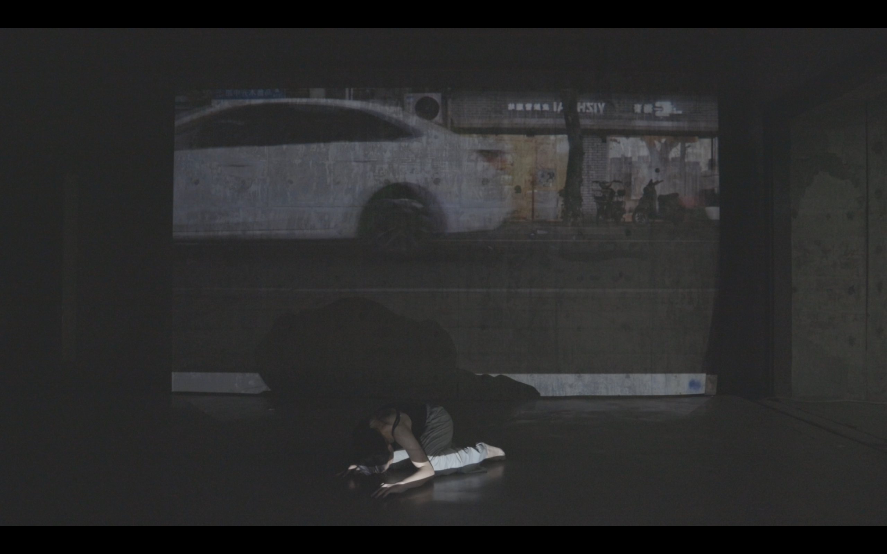
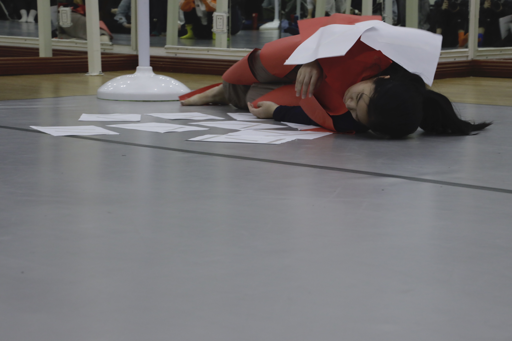
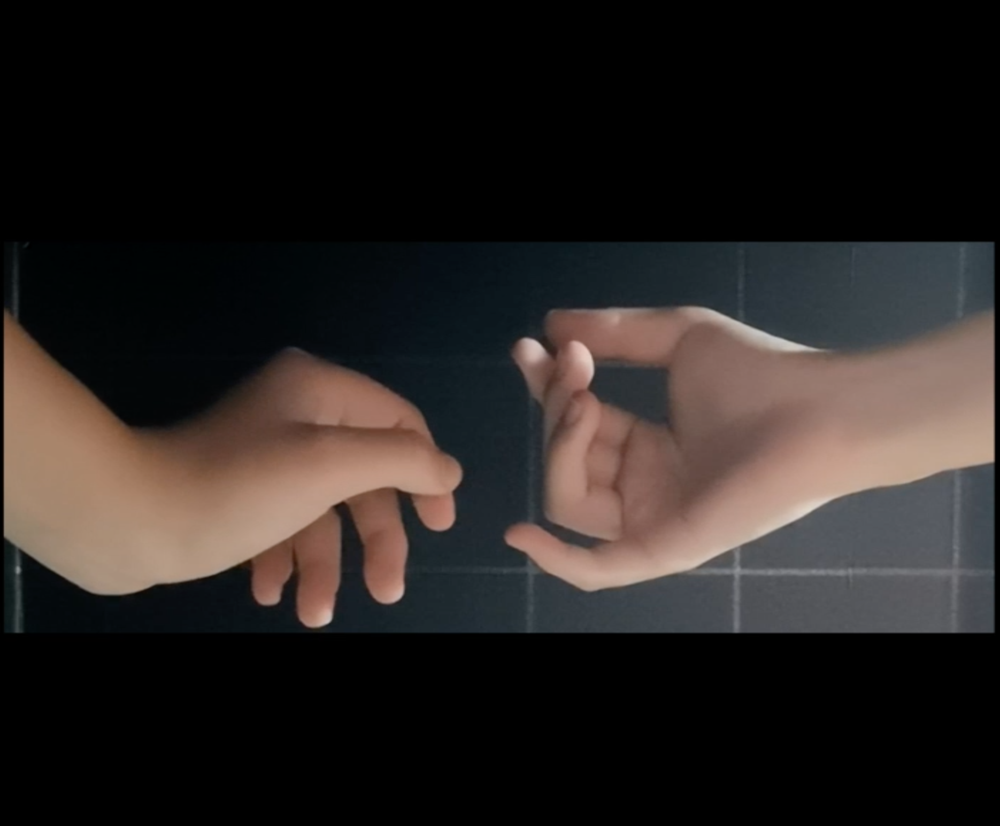

### Yeee, Bubbles disappear
05/2023, Trondheim, Norway  
a lecture-performance  
in collaboration with Julio Maquilón

I have a friend from Ecuador. The first time I visited his room, I noticed he had hung his country's national flag on the wall beside his bed. I was shocked, "I can’t fall asleep with my national flag in my bedroom." 

photo by Usman

  
 
 

### Conversation
04/2023, Multiplie Festival, Trondheim, Norway  
in collaboration with Asieh Amini as part of the project Folded Possibilities: Walk and Talk curated by Maryam Bagheri Nesami

photo by Arne Hauge

 
 
  

### The Wheel
10/2022, Trondheim, Norway  
Concept/Choreographer/Performer/Installation designer

  
 
 

### 庆典 The Celebration
07/2022, Shenzhen Greater Bay Dance Festival, China  
Concept/Choreographer/Performer/Multi-media designer

photo by Yin Peng

  
 
 

### Looking for a River 
08/2021, Shanghai, China  
concept, choreographer, performer  

*The flowing river is the flowing reality  
The reality runs through my body*  
How do people’s thinking  connect with their bodies’ senses?  
How does the change from the subject-object dichotomous epistemology to the unified phenomenological method relate to the body transition in the history of philosophy?  
How can a person become unified? Is the body a channel?  

  
 
 

### Wash
06/2021, solo version online live performance  
08/2021, group version Shanghai Suoshi Theatre, China  
concept, director, choreographer, performer  

*Whitening, Brainwashing, Heart Cleaning—Our World is Bright and Beautiful.*

  
 
 

### 知行合一2.0 Zhi Xing He Yi 2.0 
08/2021, Shanghai Suoshi Theatre, China  
concept, choreographer, performer  

“Zhi Xing He Yi” is a philosophical idea of Wang Yangming, who was a thinker in China Ming Dynasty. I intentionally  misused it as the title of this work to show the irony —- the unity of knowledge and action (translated literally).

  
 
 

### 知行合一1.0 Zhi Xing He Yi 1.0 
01/2020, Xiamen Cangjiang Theatre, China  
concept, choreographer, performer  

  
 
   
  

# Short Dance Film

### 14 Days as an Island 
08/2020, 14-day Ripples Artist Residence Program, Beijing, China  
concept, choreographer, performer  

 <https://youtu.be/QGrIBp6D-Wo>
 

  
 
  

### This is How I... 
06/2021 Hyper Youth Award, Beijing, China  
concept, choreographer, composer, performer 

<https://youtu.be/hw6YEA80sGQ>
 

  
 
  

# Music

对不起，不曾唱同一首歌 Sorry, Never Sang the Same Song <https://soundcloud.com/cindy-cao-547754078/sorry-never-sang-the-same-song>

被浪踏 Stepped by the Waves <https://soundcloud.com/cindy-cao-547754078/stepped-by-the-waves>

化水鱼 Fish Melting in the Water <https://soundcloud.com/cindy-cao-547754078/fish-melting-in-the-water>

